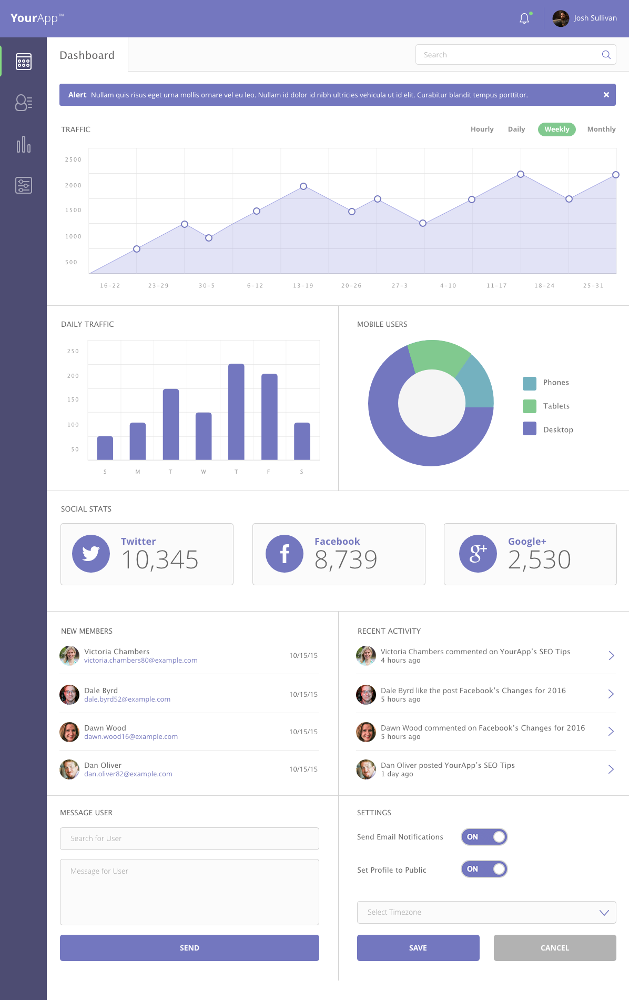
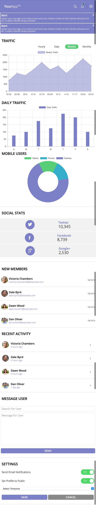
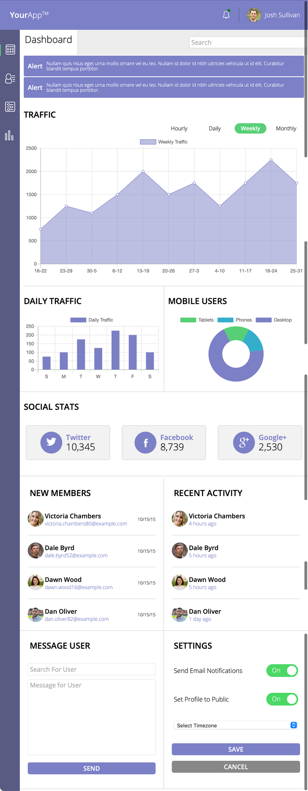
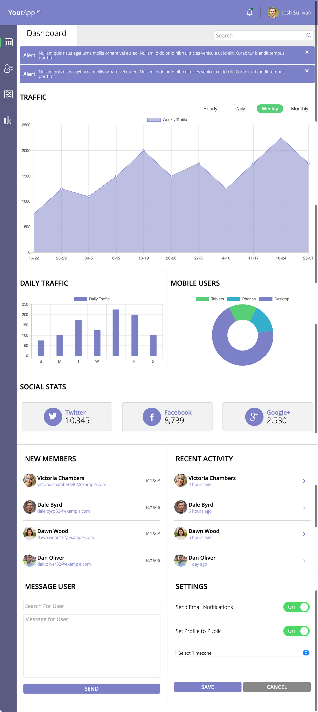

# web_app_dashboard
# WebApp Dashboard Project

## Project Description

This project implements a complete Web Dashboard containing interactive Charts, Graphs, as well as other useful/relevant functionality.

---
## Demo

https://sidharthamishra.github.io/web_app_dashboard/

---
## Features

- Mobile-First Responsive Layout/Design
- Navigation with Notifications, Search, and Dropdown Menu for Mobile
- Alerts containing useful information
- Interactive Graphs and Charts featuring Site Traffic Data
- Social Media Stats
- Stats regarding Member Activities
- The Ability to Save and Remember User's Settings using the Web Storage API
- Autocomplete Search Functionality when searching for Users in the 'Message User' Section

---
## Mockup

The project was implemented based on the following mockup with some room for modifications:


*Screenshot of the WebApp Dashboard Mockup*


---
## Results/Screenshots of the Implementation


*Screenshot of Implementation on Mobile Screens*


*Screenshot of Implementation on Tablet Sized Screens*


*Screenshot of Implementation on Large Desktop Screens*

---
## Repo Structure
```
web_app_dashboard
    |
    |
    |- css
    |   |
    |   |- vendor
    |   |      |- ionicons
    |   |      |    |- fonts
    |   |      |    |    |- ionicons.eot
    |   |      |    |    |- ionicons.svg  
    |   |      |    |    |- ionicons.ttf
    |   |      |    |    |- ionicons.woff
    |   |      |    |- ionicons.css
    |   |      |    |- LICENSE
    |   |      |
    |   |      |- toggle_switch
    |   |                |- LICENSE
    |   |                |- toggle-switch.css
    |   |                |- toggle-switch.css.map
    |   |- styles.css
    |   |- styles.css.map
    |
    |- icons
    |   |- icon-bell.svg
    |   |- icon-dashboard.svg
    |   |- icon-facebook.svg
    |   |- icon-google-plus.svg
    |   |- icon-members.svg
    |   |- icon-settings.svg
    |   |- icon-twitter.svg
    |   |- icon-visits.svg
    |
    |- img
    |   |- dashboard.png
    |   |- desktop_screenshot.png
    |   |- member-1.jpg
    |   |- member-2.jpg
    |   |- member-3.jpg
    |   |- member-4.jpg
    |   |- member-5.jpg
    |   |- mobile_screenshot.png
    |   |- tablet_screenshot.png
    |
    |
    |- js
    |   |- app.js
    |
    |- scss
    |   |- base
    |   |   |- _index.scss
    |   |   |- _normalize.scss
    |   |   |- _typography.scss
    |   |
    |   |- componenets
    |   |   |- _activity-settings.scss
    |   |   |- _alerts.scss
    |   |   |- _dash-search.scss
    |   |   |- _grid.scss
    |   |   |- _images.scss
    |   |   |- _index.scss
    |   |   |- _main-nav.scss
    |   |   |- _social-stats.scss
    |   |   |- _traffic-stats.scss
    |   |   
    |   |- utilities   
    |   |   |- _animations.scss
    |   |   |- _index.scss
    |   |   |- _mixins.scss
    |   |   |- _variables.scss
    |   |
    |   |
    |   |- styles.scss
    |    
    |- index.html
    |
    |- README.md

```

---
## Technologies Used

- HTML
- Sass/CSS
- JS
- Chart.js
- WebStorage API
- Google Fonts
- ionicons (https://ionicons.com/v2/)
- CSS Toogle Switch (ghinda.net/css-toggle-switch/)
- Color Hunt
- Random User Generator (randomuser.me/photos)
- PicResize (picresize.com)
- Markdown (Documentation) 
- Chrome Dev Tools
- VS Code

---
